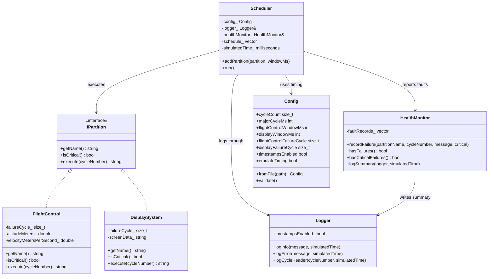

# Sunum Scripti

## 1. Açılış
Bu proje, modern C++ kullanarak geliştirilmiş basitleştirilmiş bir ARINC 653 tarzı partition scheduler simülasyonudur. Buradaki amacım gerçek bir avionics işletim sistemi yazmak değil; time partitioning, space partitioning ve fault isolation mantığını temiz, deterministic ve kolay anlatılabilir bir yapıda göstermektir.

## 2. Problem Tanımı
Aviyonik sistemlerde farklı kritik seviyelere sahip yazılımlar aynı donanım üzerinde çalışabilir. Bu durumda iki temel risk oluşur:

- bir yazılım diğerinin çalışma zamanını etkileyebilir
- bir yazılımın hatası başka bir yazılımın durumunu etkileyebilir

ARINC 653 bu problemi partitioning yaklaşımıyla çözer. Bu projede de iki partition var:

- `Flight Control` -> high criticality
- `Display System` -> low criticality

## 3. Mimari Özeti
Projeyi küçük ve anlaşılır tutmak için net bir class ayrımı kullandım:

- `IPartition`: ortak arayüz
- `FlightControl` ve `DisplaySystem`: partition implementasyonları
- `Scheduler`: major cycle ve execution order yönetimi
- `Logger`: deterministic log üretimi
- `HealthMonitor`: fault kayıt ve özetleme
- `Config`: timing ve senaryo ayarları

Buradaki temel tasarım kararı şu: scheduler sadece orchestrate ediyor, partition iç state'ine doğrudan dokunmuyor.

## 3.1 UML Class Diagram
Sistemin yapısını görsel olarak özetlemek için şu UML diyagramı kullanılabilir:

Bu diyagramı anlatırken şu kısa çerçeve kullanılabilir:

- `IPartition`, ortak contract'tır.
- `FlightControl` ve `DisplaySystem`, bu contract'ı implement eder.
- `Scheduler`, merkezi orkestrasyon sınıfıdır.
- `Logger` ve `HealthMonitor`, destek servisleri gibi çalışır.
- `Config`, sistem davranışını dışarıdan ayarlamak için kullanılır.

## 4. Time Partitioning Nasıl Gösteriliyor?
Sistem sabit bir `100 ms major cycle` kullanıyor:

- `Flight Control` -> `60 ms`
- `Display System` -> `40 ms`

Execution order her zaman aynı:

1. Flight Control
2. Display System
3. Repeat

Bu sayede çalışma sırası tamamen deterministic oluyor.

## 5. Space Partitioning Nasıl Gösteriliyor?
Her partition kendi private state’ini tutuyor:

- `FlightControl`: altitude ve velocity
- `DisplaySystem`: screenData

Shared global variable yok. Scheduler sadece `execute()` çağırıyor. Böylece bir partition’ın iç verisi başka bir partition veya scheduler tarafından doğrudan değiştirilmiyor.

## 6. Fault Isolation Nasıl Gösteriliyor?
Display partition belirli bir cycle'da kontrollü olarak exception fırlatıyor. Scheduler bu hatayı `try-catch` ile yakalıyor, logluyor ve `HealthMonitor` içine kaydediyor.

Buradaki kritik nokta şu:

- sistem tamamen çökmüyor
- Flight Control sonraki cycle'larda çalışmaya devam ediyor

Bu da non-critical bir partition hatasının tüm sistemi durdurmaması fikrini gösteriyor.

Ek olarak artık Flight Control tarafında da controlled fault verilebiliyor. Bu durumda davranış farklı:

- fault `HealthMonitor` içine kaydediliyor
- partition critical olduğu için scheduler sistemi durduruyor
- sonraki cycle'lar çalıştırılmıyor

Böylece sunumda non-critical ve critical fault farkı birlikte gösterilebiliyor.

## 7. Health Monitoring Ne Yapıyor?
`HealthMonitor` şu bilgileri saklıyor:

- hangi partition hata verdi
- hangi cycle’da hata oldu
- hata mesajı neydi
- partition critical miydi

Run sonunda kısa bir summary veriyor. Bu da fault traceability açısından önemli.

## 8. Neden Bu Tasarım Uygun?
Bu projeyi özellikle şu niteliklerde tuttum:

- deterministic
- modüler
- okunabilir
- single-threaded
- presentation-friendly

Çünkü burada amaç complexity göstermek değil, temel sistem mantığını doğru ve temiz göstermek.

## 9. Muhtemel Sorulara Kısa Cevaplar
### Neden single-threaded tuttun?
Çünkü assignment’ın ana odağı determinism ve explainability. Concurrency bu proje için faydadan çok complexity getirirdi.

### Neden interface kullandın?
Çünkü scheduler’ın concrete class’lara bağımlı olmaması gerekiyordu. `IPartition` sayesinde tasarım daha modüler ve genişletilebilir oldu.

### Bu gerçek ARINC 653 implementasyonu mu?
Hayır. Bu bir educational simulation. Ama static scheduling, isolation ve fault containment gibi temel ARINC 653 fikirlerini doğru şekilde yansıtıyor.

### Neden Display hata verince sistem durmuyor?
Çünkü bu partition non-critical olarak modellenmiş durumda. Amaç mixed-criticality sistem mantığını göstermek.

### Neden Flight Control hata verince scheduler duruyor?
Çünkü `Flight Control` critical partition olarak tanımlı. Scheduler, critical failure kaydı gördüğünde sistemi güvenli şekilde durduruyor.

## 10. Kapanış Cümlesi
Bu proje, sabit schedule, private partition state ve kontrollü fault handling ile ARINC 653’in temel fikirlerini sade ama teknik olarak tutarlı bir C++ simülasyonu halinde göstermektedir.

## 11. Teorik Sorulara Kısa Hazır Cevaplar
### IMODE: Interface nedir?
Interface, iki bileşen arasındaki tanımlı etkileşim sınırıdır. Bir bileşenin nasıl kullanılacağını söyler ama iç implementasyonu açmaz.

### IMODE: Interface’in iki amacı nedir?
- Bileşenler arası bağımlılığı azaltır
- Modüler geliştirme ve test etmeyi kolaylaştırır

### JDK, JRE, JVM farkı nedir?
- `JVM`: Java bytecode’u çalıştıran sanal makinedir
- `JRE`: Java programını çalıştırmak için gerekli runtime ortamıdır, JVM’i ve temel library’leri içerir
- `JDK`: Java geliştirmek için gereken tam pakettir, JRE’yi ve derleyici araçlarını içerir

### Aralarındaki ilişki nedir?
Hiyerarşi şu şekildedir:

`JDK -> JRE -> JVM`

### Java source code nasıl çalışır?
Önce `.java` source code yazılır. `javac` bunu bytecode’a çevirir. Ortaya çıkan `.class` dosyaları JVM tarafından load edilir, doğrulanır ve çalıştırılır.

### ARINC 653’te time partitioning neden önemli?
Çünkü kritik bir fonksiyonun CPU erişimi başka bir fonksiyon yüzünden gecikmemelidir. Bu predictability ve safety sağlar.

### ARINC 653'te space partitioning neden önemli?
Çünkü bir partition'daki hata veya veri bozulması başka bir partition'ın belleğine ya da state'ine yayılmamalıdır. Bu fault containment sağlar.

### Gerçek hayatta hangi problemi çözer?
Mixed-criticality uygulamaların aynı platformda güvenli ve öngörülebilir şekilde çalışmasını sağlar. Özellikle avionics gibi safety-critical alanlarda bu çok önemlidir.
