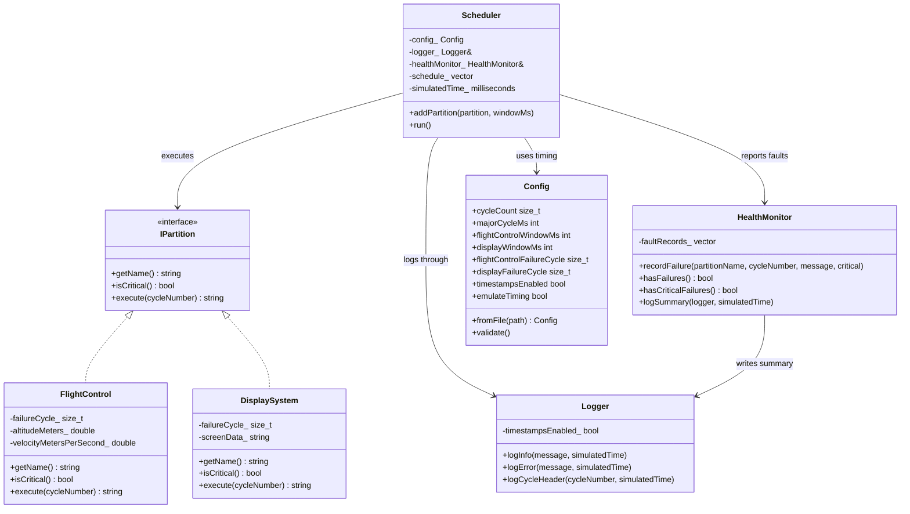

## UML Class Diagram
Sistemin yapısını görsel olarak özetlemek için şu UML diyagramı kullanılabilir:

Bu diyagramı anlatırken şu kısa çerçeve kullanılabilir:

- `IPartition`, ortak contract'tır.
- `FlightControl` ve `DisplaySystem`, bu contract'ı implement eder.
- `Scheduler`, merkezi orkestrasyon sınıfıdır.
- `Logger` ve `HealthMonitor`, destek servisleri gibi çalışır.
- `Config`, sistem davranışını dışarıdan ayarlamak için kullanılır.

